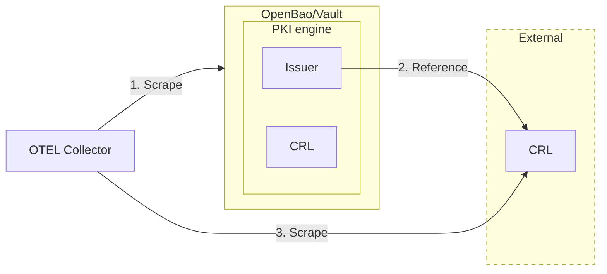

# OpenTelemetry Collector PKI engine receiver
This OpenTelemetry Collector Receiver scrapes metrics for [OpenBao](https://openbao.org/) and [Vault](https://www.hashicorp.com/en/products/vault)  PKI engines by auto-discovering mounts, issuers and certificate revocation lists (CRLs). It supports setups where the CRLs are hosted outside of the secret store, e.g., in multi-tier PKI setups with an offline root.



## Features
- Auto discover engines of type `pki`, issuers and CRLs (base & delta).
- Collect referenced CRLs hosted outside of the secret store.
- Tested against OpenBao and Vault.
- Support for [namespaces](https://openbao.org/docs/concepts/namespaces/).
- Resolve AIA URL templating.
- Implemented CRL protocols:
  - HTTP
  - LDAP
- Efficient CRL fetching:
  - Prevents thundering hurds.
  - Respects `ETag` and `Last-Modified` HTTP headers.
- Authenticate via:
  - Token
  - AppRole
  - Kubernetes
  - JWT

# Metrics
For collected metrics and attributes, see [documentation.md](documentation.md).

## Considerations
- This receiver doesn't cover leaf certificates. It's recommended to monitor leaf certificates where they are actively used via e.g. [tlscheckreceiver](https://github.com/open-telemetry/opentelemetry-collector-contrib/tree/main/receiver/tlscheckreceiver). When using cert-manager on Kubernetes consider collecting `Certificate` resources via the [k8sobjectsreceiver](https://github.com/open-telemetry/opentelemetry-collector-contrib/tree/main/receiver/k8sobjectsreceiver).

- Tidy metrics which includes counters for issued and revoked certificates can be collected via the exposed telemetry endpoints by the secret store and scraped via e.g. Prometheus jobs. See `secrets.pki.tidy.*` metrics ([OpenBao](https://openbao.org/docs/internals/telemetry/metrics/all/) | [Vault](https://developer.hashicorp.com/vault/docs/internals/telemetry/metrics/all)). For extra large deployments consider disabling metric `pkiengine.mount.certificates_stored` and rely on Tidy metrics as secret stores efficiently track changes to maintain internal counters.

# Installation
Adding components to an OTeL Collector requires building a custom collector via [OpenTelemetry Collector builder](https://github.com/open-telemetry/opentelemetry-collector/tree/main/cmd/builder) (or ocb for short).

When building a custom collector you can add this receiver to the manifest file like the following:
```yaml
receivers:
  - gomod: github.com/cvdtang/pkienginereceiver v0.148.0
```

# Configuration
## Example
```yaml
receivers:
  pkiengine:
    address: https://openbao.example.com
    namespace: tenant-a
    collection_interval: 5m
    crl:
      retries: 1
    auth:
      type: approle
      approle:
        role_id: "my-role-id"
        secret_id: "my-secret-id"
```

## Options
- `address` *(string)*: (default = `http://127.0.0.1:8200`) Address of secret store. Must be formatted as `{protocol}://{host}`.
- `collection_interval` *(string)*: (default = `5m`) How frequently the scraper should be called. This value must be a string readable by Golang's [time.ParseDuration](https://pkg.go.dev/time#ParseDuration). Valid time units are `ns`, `us` (or `µs`), `ms`, `s`, `m`, `h`.
- `initial_delay` *(string)*: (default = `0s`) Initial start delay for the scraper.
- `timeout` *(string)*: Optional value used to set scraper's context deadline.
- `namespace` *(string)*: (default = `""`) Secret store namespace path.
- `match_regex` *(string)*: (default = `".*"`) Regular expression in [RE2 syntax](https://github.com/google/re2/wiki/Syntax) of allowed mount paths, e.g. `pki/v1/ica/v\d`.
- `concurrency_limit` *(uint)*: Maximum number of concurrent worker tasks (mount/issuer/CRL). Defaults to the number of CPU cores determined by GOMAXPROCS.

### CRL
- `crl.enabled` *(bool)*: (default = `true`) Enable CRL processing.
- `crl.scrape_parent` *(bool)*: (default = `true`) Enable scraping issuer-role (parent) CRLs referenced in issuer certificates. When `false`, only subject-role CRLs from issuer API fields are scraped.
- `crl.cache_size` *(uint)*: (default = `50`) Maximum number of entries in the LRU cache for processed CRLs. Set to `0` to disable CRL caching.
- `crl.timeout` *(string)*: (default = `5s`) Maximum time to wait for a CRL fetch response.
- `crl.retries` *(uint)*: (default = `0`) Number of retry attempts for CRL fetching after the initial attempt.
- `crl.retry_interval` *(string)*: (default = `3s`) Wait interval between CRL fetch retry attempts.

### Authentication
- `auth.type` *(string)*: (default = `token`) Authentication method to use. Allowed values: `token`, `approle`, `kubernetes` and `jwt`.

#### Token
Docs: [OpenBao](https://openbao.org/docs/auth/token/) | [Vault](https://developer.hashicorp.com/vault/docs/auth/token)
- `auth.token.token` *(string)*: Static authentication token.

```yaml
receivers:
  pkiengine:
    auth:
      type: token
      token:
        token: ${env:TOKEN}
```

#### AppRole
Docs: [OpenBao](https://openbao.org/docs/auth/approle/) | [Vault](https://developer.hashicorp.com/vault/docs/auth/approle)
- `auth.approle.role_id` *(string)*: AppRole RoleID.
- `auth.approle.secret_id` *(string)*: AppRole SecretID.
- `auth.approle.wrapping_token` *(bool)*: (default = `false`) Use single-use token that prevents the underlying credential from being exposed in transit.
- `auth.approle.mount_path` *(string)*: (default = `approle`) Mount path of the AppRole auth engine.

```yaml
receivers:
  pkiengine:
    auth:
      type: approle
      approle:
        role_id: ${env:APPROLE_ROLE_ID}
        secret_id: ${env:APPROLE_SECRET_ID}
```

#### Kubernetes
Docs: [OpenBao](https://openbao.org/docs/auth/kubernetes/) | [Vault](https://developer.hashicorp.com/vault/docs/auth/kubernetes)

- `auth.kubernetes.role_name` *(string)*: Name of the secret store role with Kubernetes service account bound to it.
- `auth.kubernetes.service_account_token` *(string)*: Override Kubernetes service account JWT.
- `auth.kubernetes.service_account_token_path` *(string)*: Path where the Kubernetes service account token is mounted in the pod.
- `auth.kubernetes.mount_path` *(string)*: (default = `kubernetes`) Mount path of the Kubernetes auth engine.

The kubernetes auth method can be used to authenticate with the secret stores using a Bound Service Account Token. Defaults to `/var/run/secrets/kubernetes.io/serviceaccount/token`:
```yaml
receivers:
  pkiengine:
    auth:
      type: kubernetes
      kubernetes:
        role_name: my-role
```

Alternatively, long-lived tokens can be used:
```yaml
receivers:
  pkiengine:
    auth:
      type: kubernetes
      kubernetes:
        role_name: my-role
        service_account_token: ${env:SERVICE_ACCOUNT_TOKEN}
```

#### JWT
Docs: [OpenBao](https://openbao.org/docs/auth/jwt/) | [Vault](https://developer.hashicorp.com/vault/docs/auth/jwt)

- `auth.jwt.role_name` *(string)*: Name of the role in OpenBao/Vault with JWT claims bound to it.
- `auth.jwt.token` *(string)*: JWT token to use for authentication.
- `auth.jwt.token_path` *(string)*: Path to a file containing the JWT token.
- `auth.jwt.mount_path` *(string)*: (default = `jwt`) Mount path of the JWT auth engine.

From value:
```yaml
receivers:
  pkiengine:
    auth:
      type: jwt
      jwt:
        role_name: my-role
        token: ${env:JWT_TOKEN}
```

From file:
```yaml
receivers:
  pkiengine:
    auth:
      type: jwt
      jwt:
        role_name: my-role
        token_path: /my/token
```

### Metrics & Resource Attributes
- `metrics.<name>.enabled` *(bool)*: (default = `true`) Enable/disable emitting the specified metric.
- `resource_attributes.<name>.enabled` *(bool)*: (default = `true`) Enable/disable emitting the specified resource attribute.

Additionally, the [Vault Go SDK environment variables](https://developer.hashicorp.com/vault/docs/commands#configure-environment-variables) can be set, e.g. `VAULT_SKIP_VERIFY`.

## Authorization policy
Required permissions used by the receiver.

**Note that the `pki/*` paths can differ depending on where the PKI engines are mounted.**

```hcl
# ref: https://developer.hashicorp.com/vault/api-docs/system/mounts#list-mounted-secrets-engines
path "sys/mounts" {
  capabilities = [ "read" ]
}

# ref: https://developer.hashicorp.com/vault/api-docs/secret/pki#read-cluster-configuration
path "pki/config/cluster" {
  capabilities = [ "read" ]
}

# ref: https://developer.hashicorp.com/vault/api-docs/secret/pki#list-certificates
path "pki/certs" {
  capabilities = [ "list" ]
}

# ref: https://developer.hashicorp.com/vault/api-docs/secret/pki#read-issuer
path "pki/issuer/+" {
  capabilities = [ "read" ]
}
```

# Troubleshooting
Enable OTeL Collector debug logging:
```yaml
receivers:
  pkiengine:
    address: http://127.0.0.1:8200
    initial_delay: 0s
    collection_interval: 1m

service:
  telemetry:
    logs:
      level: debug

  pipelines:
    metrics:
      receivers: [pkiengine]
      exporters: [debug]
```

# Development
For development, internals and testing, see [DEVELOPMENT.md](DEVELOPMENT.md).
